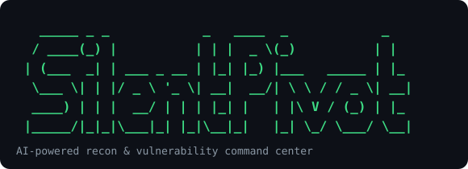

<p align="center">
  
</p>

# SilentPivot


**SilentPivot** is an AI-powered reconnaissance and vulnerability-analysis **command
center** for penetration testing and red-team work. It drives many tools from a single
terminal panel, verifies findings against authoritative sources (NVD, CISA KEV, EPSS),
and turns everything into a professional report — in one command.

Its guiding principle: **surface everything that matters, drown the user in nothing.**
Signal over noise, verified data over guesses, graceful behaviour on any network.

---

## Features

**Recon**
- **Nmap scanning** — service/version detection with sane defaults (`-Pn`, top-1000, IPv6-aware, host-timeout).
- **Subdomain discovery** — hybrid engine: uses `subfinder`/`amass` if installed, always merges keyless passive sources (crt.sh, certspotter, AlienVault OTX, HackerTarget, Anubis).
- **Native port check** — fast TCP open/closed test in pure Python, no nmap needed.
- **Web fingerprinting** — HTTP probe with technology detection (WordPress, Nginx, ASP.NET…) and WAF/CDN detection (Cloudflare, Imperva Incapsula, Akamai…).

**Vulnerability intelligence**
- **CVE matching** — CPE-based queries against the NIST **NVD** database.
- **CISA KEV** — flags CVEs **actively exploited in the wild**.
- **EPSS** — exploitation-probability score per CVE.
- **Exploit mapping** — public GitHub PoCs + **ExploitDB** (via `searchsploit`).
- **Nuclei** — active templated scanning (thousands of community templates).

**Active testing** (evidence-based — a finding is confirmed by concrete proof, never a guess)
- **403 bypass** — 39 forbidden-path bypass techniques (header spoofing, path mutation, method change).
- **Leak / secret finder** — exposed keys, tokens, and files (`.git`, `.env`, `.htpasswd`, backups) via signature + 404-baseline.
- **Path traversal / LFI** — parameter file-read fuzzing, confirmed by response signatures (`/etc/passwd`, `win.ini`, PHP source).
- **SSRF** — cloud-metadata probing, confirmed only by real metadata tokens (reflected payloads are filtered out).
- **Content discovery** — hidden paths/panels/backups via `ffuf`/`gobuster` or a pure-Python fuzzer, with soft-404 filtering.

**Analysis & reporting**
- **AI analysis** — an LLM writes a senior-pentester report, grounded strictly on verified CVEs (no hallucinated CVE numbers).
- **AI co-pilot** — reads the current recon state and recommends prioritized next actions.
- **MITRE ATT&CK mapping** — deterministic finding→technique mapping + an AI-narrated kill-chain (technique IDs never invented).
- **Autopilot** — the whole pipeline in one command.
- **Reports** — Markdown, JSON, or a polished self-contained **HTML** report.

**Red-team & workflow**
- **OPSEC / stealth profiles** — `normal` / `stealth` (slow nmap, request jitter, capped workers) / `passive` (zero packets to the target); optional proxy (Tor/Burp/proxychains).
- **Persistent task tree** — every finding becomes a tracked "lead" (open / done / no-result) stored per target, so an engagement survives closing and reopening the tool.
- **Layered disclosure** — confirmed services shown first; WAF/decoy phantom ports collapsed but saved in full to the report.
- **WAF / firewall awareness** — tells you when a target is behind a WAF or when your own network is blocking the scan.
- **Network-adaptive** — auto-detects IPv6 connectivity and multi-IP (round-robin) targets, and lets you pick which IP to scan.
- **Hardened input handling** — every target/URL is validated (no nmap argument injection), and target-controlled output can't forge the terminal or hang the scanner.

---

## How it works (Autopilot pipeline)

```
Target
  │
  ├─ 1. Nmap            → open ports + services
  ├─ 2. CVE/KEV/EPSS    → verified vulns + real exploitability
  ├─ 3. Web probe       → tech stack + WAF/CDN
  ├─ 4. Nuclei          → active vulnerability scan
  ├─ 5. AI analysis     → prioritized expert report
  └─ 6. Report          → one unified MD / JSON / HTML file
```

Each stage is isolated — if one fails, the pipeline degrades gracefully instead of aborting.

---

## Prerequisites

- **Python 3.8+**
- **Nmap** on your PATH — for the nmap scan module. ([Download](https://nmap.org/download.html))
- **AI API key** (OpenAI-compatible) — only for the AI report module.
- **Optional** (unlock the hybrid tools, e.g. on Kali): `nuclei`, `subfinder`/`amass`, `searchsploit` (exploitdb), `ffuf`/`gobuster`.

---

## Installation

### Quick install (recommended)

The installer sets up **everything** on a fresh machine — it installs Python itself if
it's missing, then pipx, then the `silentpivot` command globally (so it works from any
folder, like `nmap`, with no venv to activate):

```bash
git clone https://github.com/yusufseday/SilentPivot.git
cd SilentPivot
bash install.sh                    # Linux / Kali
```

```powershell
git clone https://github.com/yusufseday/SilentPivot.git
cd SilentPivot
powershell -ExecutionPolicy Bypass -File .\install.ps1    # Windows
```

Open a **new terminal** afterwards (so PATH refreshes), then just run `silentpivot`.
The install is *editable*, so a later `git pull` updates the tool in place — no reinstall.

> **Note:** SilentPivot orchestrates external recon tools (`nmap`, `nuclei`, `ffuf`…).
> Those can't be bundled — install them via your OS package manager (on Kali most are
> preinstalled). The script tells you which are present and which are missing.

### Manual install (venv)

Prefer a self-contained virtual environment?

```bash
python3 -m venv venv
source venv/bin/activate          # Windows: .\venv\Scripts\activate
pip install -e .                   # installs the `silentpivot` command
cp .env.example .env               # then add your key
```

> `pip install -e .` installs in editable mode (so `git pull` updates it in place).
> Not installing at all? `pip install -r requirements.txt` works too — then run it with
> `python -m silentpivot`. For SOCKS proxy (Tor/proxychains): `pip install -e ".[socks]"`.

`.env`:
```ini
AI_API_KEY=your_api_key_here
NVD_API_KEY=            # optional — speeds up CVE queries
```

Verify everything works against the real data sources:
```bash
python scripts/selftest.py         # live end-to-end check of every module
```

---

## Usage

**Interactive panel (default):**
```bash
silentpivot                        # or: python -m silentpivot
```

```
 A   Autopilot / Full Engagement   (runs the whole pipeline)
 ?   AI Co-pilot                   (what should I do next?)

 1   Nmap Port Scan                (service/version detection)
 2   Subdomain Discovery           (passive OSINT + DNS)
 3   Quick Port Check              (open/closed — no nmap needed)
 4   Web Probe & Fingerprint       (HTTP tech/WAF detection)
 5   Nuclei Vuln Scan              (active templated scanning)
 6   CVE + KEV Vuln Analysis       (on the last scan)
 7   Generate AI Report            (on the last scan)
 8   Saved Reports
 9   403 Bypass                    (forbidden-path bypass techniques)
 L   Leak / Secret Finder          (exposed keys, tokens, .git/.env)
 P   Path Traversal / LFI          (parameter file-read fuzzing)
 S   SSRF                          (cloud-metadata probing)
 C   Content Discovery             (hidden paths / panels / backups)
 T   Task Tree                     (persistent engagement leads)
 M   MITRE ATT&CK Map              (+ AI kill-chain narrative)
 O   OPSEC Profile                 (stealth / passive / proxy)
 0   Exit
```
After an Nmap scan, the findings stay in memory — CVE analysis, Nuclei, the AI report
and the ATT&CK map all chain off that scan, and every finding feeds the persistent task
tree.

**Autopilot — full engagement in one command:**
```bash
silentpivot -t target.com --auto -f html
```

**CLI / automation:**
```bash
silentpivot -t scanme.nmap.org -s deep -f json -o report.json
silentpivot -t 10.0.0.5 -s fast --no-ai --quiet
```

Routing through a proxy (keeps nmap's packets covered too):
```bash
proxychains4 silentpivot -t target.com --auto
```

| Flag | Description |
|------|-------------|
| `-t, --target` | Target IP/domain |
| `-s, --scan-type` | `1/fast`, `2/standard`, `3/deep` |
| `--auto` | Autopilot: full engagement pipeline |
| `--no-ai` | Skip AI analysis |
| `-f, --format` | `md`, `json`, or `html` |
| `-o, --output` | Report file path |
| `-q, --quiet` | Quiet mode |

Reports are saved under `data/`. Open an HTML report in any browser:
```bash
xdg-open data/*.html      # or: firefox data/*.html
```

---

## Project structure

```
SilentPivot/
├── install.sh             # One-command setup for Linux/Kali (Python + deps + command)
├── install.ps1            # One-command setup for Windows
├── pyproject.toml         # Packaging + entry point (silentpivot command)
├── .github/workflows/     # CI: ruff lint + offline pytest on push/PR
├── silentpivot/           # The importable package
│   ├── cli.py             # Entry point (panel + CLI / argparse)
│   ├── __main__.py        # Enables `python -m silentpivot`
│   ├── panel.py           # Interactive command center
│   ├── ui.py              # Shared UI (console, colors, tables)
│   ├── validators.py      # Single source of input validation
│   ├── opsec.py           # OPSEC/stealth profile + proxy + body caps
│   ├── autopilot.py       # Full-engagement orchestrator
│   ├── scanner.py         # Nmap integration + scan context
│   ├── subdomain.py       # Hybrid subdomain discovery
│   ├── portcheck.py       # Native TCP port check
│   ├── webprobe.py        # HTTP fingerprinting + WAF detection
│   ├── nuclei.py          # Nuclei wrapper
│   ├── bypass403.py       # 403 forbidden-path bypass
│   ├── leakfinder.py      # Exposed secrets/files
│   ├── pathtraversal.py   # Path traversal / LFI
│   ├── ssrf.py            # SSRF (cloud metadata)
│   ├── contentdisco.py    # Content discovery (ffuf/gobuster/python)
│   ├── vuln_checker.py    # NVD (CPE) + CVSS matching
│   ├── kev.py             # CISA KEV catalog
│   ├── exploits.py        # EPSS + PoC + ExploitDB intel
│   ├── attack_map.py      # MITRE ATT&CK technique mapping
│   ├── ai_engine.py       # LLM analysis engine
│   ├── tasktree.py        # Persistent engagement task tree
│   └── reporter.py        # MD / JSON / HTML reports
├── tests/                 # Offline unit tests + opt-in live checks (pytest)
├── scripts/selftest.py    # Live end-to-end self-test of every module
└── data/                  # Auto-generated reports + engagements (gitignored)
```

---

## Testing

```bash
pip install -e ".[dev]"    # pull in pytest

pytest                     # offline unit tests — fast, deterministic (what CI runs)
pytest -m live             # opt-in live checks against real sources (needs network)
python scripts/selftest.py # full live end-to-end self-test with a readable report
```

The offline suite covers the parsers, detectors, input validation, the persistent task
tree, and the ReDoS time-budget regression guard. Live checks (NVD, KEV, EPSS, DNS,
HTTP) are excluded from the default run so it stays hermetic.
